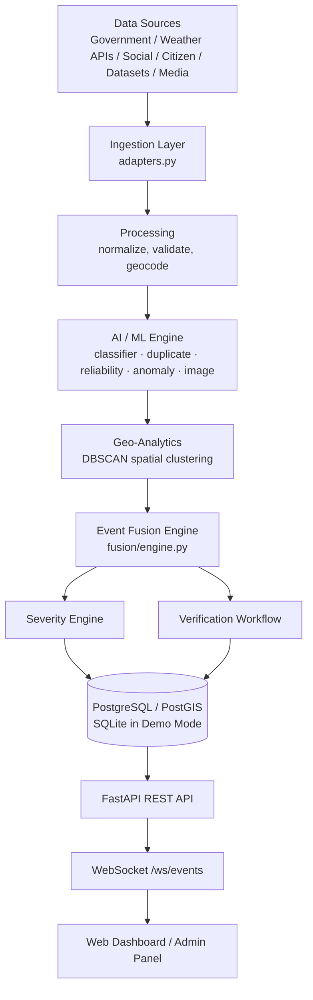
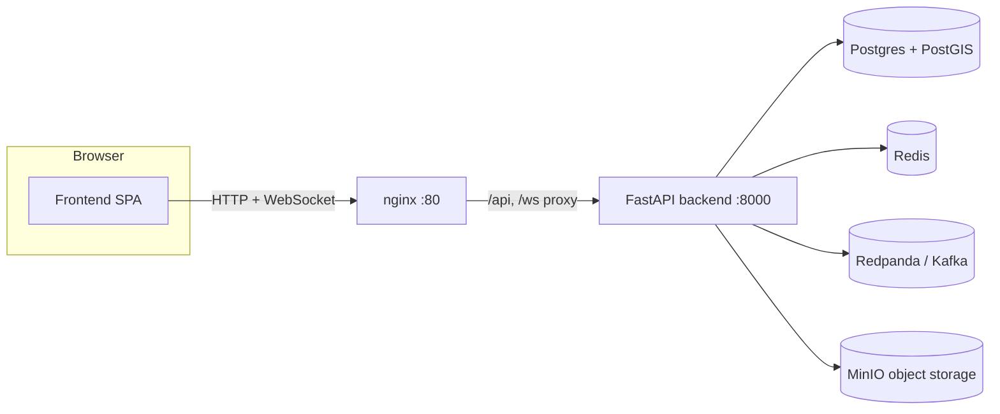
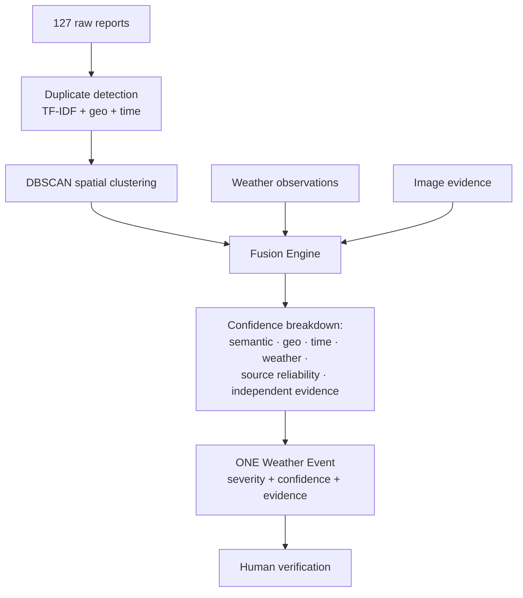

# INDRA Architecture

## Pipeline

## Deployment topology (Docker Compose)

## Event Fusion (the core differentiator)

## Demo Mode vs Live Mode

| Concern | Demo Mode (default) | Live Mode |
|---|---|---|
| Database | SQLite file, lat/lng floats | Postgres + PostGIS, `geography(Point)` |
| Streaming | In-process asyncio bus (`realtime/pubsub.py`) | Kafka / Redpanda topics |
| Cache / fan-out | Same in-process bus | Redis pub/sub |
| Object storage | Media referenced by URL/category only | MinIO (S3-compatible) |
| ML classification | Lexicon + scoring (explainable, no download) | Fine-tuned transformer, same `classify()` signature |
| Semantic similarity | TF-IDF + cosine (scikit-learn) | Sentence-Transformers embeddings, same `pairwise_similarity()` signature |
| Image analysis | Declared-category simulation with transparent confidence | OpenCV / lightweight CNN, same `analyze()` signature |

Switching from Demo to Live Mode is an environment-variable change
(`DATABASE_URL`, `REDIS_URL`, `KAFKA_BOOTSTRAP_SERVERS`, `MINIO_*` in
`.env`) plus swapping the four ML function bodies noted above — the API,
database schema, and frontend do not change.
