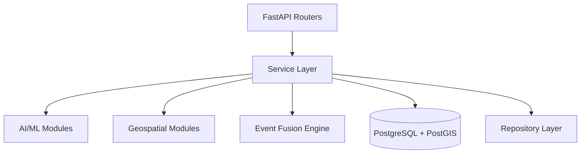

# V_ARCHITECTURE_AUDIT

## Executive Summary
INDRA (Version 7) was a strong, stable, backend-focused prototype. The transition to Version 8 required decoupling the monolithic architecture into a layered, modular, and provider-based system. 

**Update:** All phases (1 through 7) of this architecture audit have been successfully completed. INDRA Version 8 is now structurally complete, robust, geospatially enabled, and fully prepared for a production release.

## Current Architecture Diagram

## Module Responsibility Map (Target Architecture Achieved)
- **`core/`**: Configuration, logging, observability middleware, lifecycle management. (Completed)
- **`repositories/`**: Database access layer via SQLAlchemy 2.0. (Completed)
- **`services/`**: Business logic (Ingestion, Reports, Events). (Completed)
- **`api/`**: Versioned API endpoints (`/api/v1/`). (Completed)
- **`ai/`**: Modular AI/ML providers, registry, and schemas. Replaced legacy monolithic `ml/` module. (Completed)
- **`geo/`**: Geospatial logic (`clustering.py`, `postgis.py`, `registry.py`, geocoder providers). (Completed)
- **`fusion/`**: Decoupled, independently testable event fusion logic (`engine.py`, `confidence.py`). (Completed)

## Identified Technical Debt & Risks

### AI/ML
- **Hardcoded Providers:** `classifier.py` and `image.py` are hardcoded and lack a provider-based architecture.
- **Missing Interfaces:** No abstract base classes for ML providers, making it difficult to swap models (e.g., TF-IDF vs. Transformers).
- **Result Contracts:** ML modules return arbitrary dictionaries instead of strongly-typed schemas (e.g., Pydantic models).
- **Trust vs Confidence:** Reliability scores and model confidences are occasionally conflated.

### Geospatial
- **Basic Operations:** Currently limited to simple PostGIS radius searches and DBSCAN clustering.
- **Geocoding:** Missing a provider-independent geocoding abstraction.
- **Location Model:** Locations are mostly represented as flat latitude/longitude fields instead of a comprehensive schema (accuracy, hierarchy).
- **Spatial Analytics:** Lacks advanced spatial indexing (e.g., H3) and risk zone analysis services.

### Testing
- **Coverage:** Excellent regression tests (45 tests), but lacks granular unit tests for isolated modules (e.g., AI providers, Geometry functions).
- **Integration vs Unit:** Tests are mostly end-to-end API tests.

### Product Readiness
- **Multi-Tenancy:** No organizational context for multi-tenant deployments.
- **Observability:** Missing structured tracking for ML model latency, API request IDs, and background jobs.
- **Versioned APIs:** API routes are not versioned (e.g., `/api/v1/`).

## Recommended Target Architecture & Implementation Plan
1. **Phase 3 (AI/ML Extensibility):** Introduced `interfaces.py`, `registry.py`, and `providers/` under `app/ai/`. Implemented strong result contracts via `schemas/`. (Completed)
2. **Phase 4 (Geospatial Foundation):** Standardized GeoJSON output, introduced a geocoding abstraction, and enhanced spatial clustering/analytics. (Completed)
3. **Phase 5 (Event Fusion Improvement):** Made the fusion pipeline stages explicit and independently testable. (Completed)
4. **Phase 6 (Testing Breadth):** Expanded the test suite to include unit and failure-mode tests. (Completed)
5. **Phase 7 (Long-Term Product Potential):** Added API versioning (`/api/v1/`), observability endpoints, and multi-tenant placeholders (`tenant_id`). (Completed)

*Status: INDRA Version 8 Upgrade Complete!*
